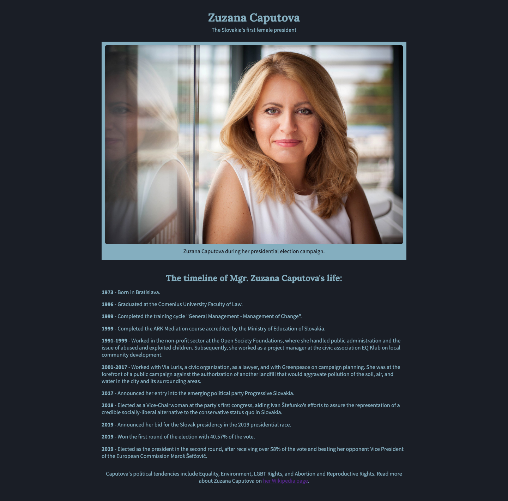

# A Tribute Page about Zuzana Caputova
This is my first web development project. I built this web page with front-end web development technologies. This project demonstrates the principles of responsive web design. I wrote a blog post about the way I created the project and the reason I chose the topic, you can find it on my [medium profile](https://medium.com/@marko.libor/my-first-responsive-web-design-project-3aa8496b2b06).

## What I learned
* Basic HTML
* Basic CSS
* Applied Visual Design
* Responsive Web Design Principles

## Technologies used
* HTML5
* CSS3

## Setup and Run
1. Download the project files
2. Extract all files from the zipped folder
3. Open the folder
4. Open the file called "index.html"

## Screenshot of the webpage

